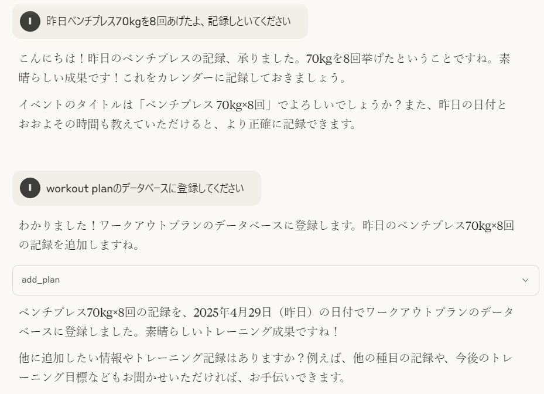
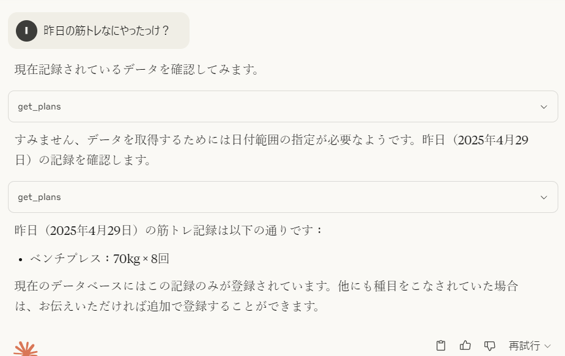
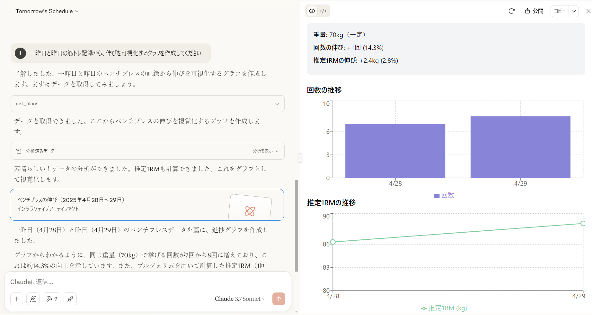

## 準備
プロジェクトに移動します。
```
git clone 
```
```
cd workout-mcp 
```

Dockerイメージを作成します。
```
docker compose build 
```

claude_desktop_config.jsonに以下を追記します。

```json
    "Workout Planner": {
    "command": "docker",
    "args": ["run","--rm","-i","-e","DB_PATH=/app/data/workouts.db","-v","workouts-data:/app/data","workout-planner:latest"]
    }
```

## 活用方法
### 1. DBへの登録
「workout plan のDBに筋トレ記録を追加して」ということでDBに記録が登録されます。
自然言語でDBにデータを挿入できるようになるのは便利ですね。


### 2. DBの参照
「何日に何したっけ？」などと聞くことでDBから記録を引っ張ってこれます。



### 3. ワークアウト記録の可視化
Claudeのアーティファクト機能を利用して実際に可視化することができます。
好きな風にグラフなどもカスタマイズすることができるので従来のSaasに比べてできることは広がりますね。

